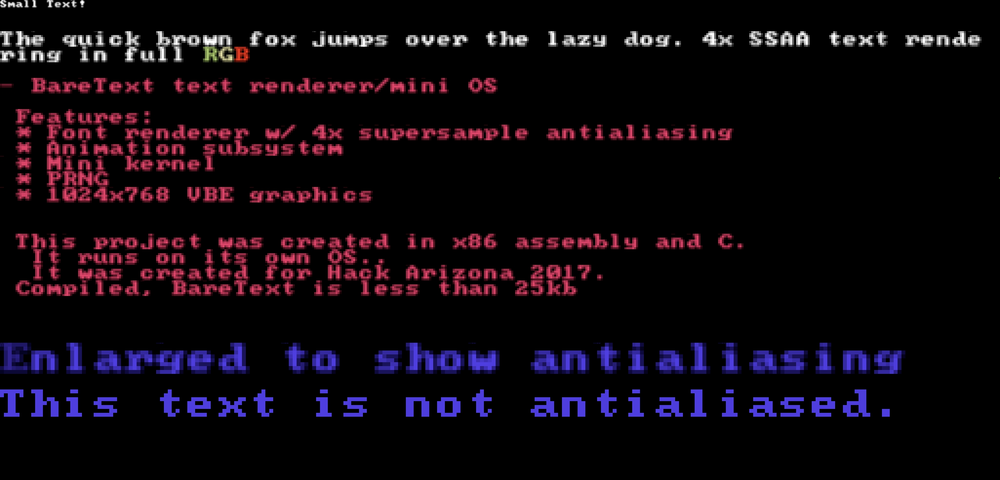

BareText
--------------------------

BareText is an x86_32 OS built for HackArizona 2017. 

The main feature is the font renderer, which does full supersampling antialiasing up to 4x. BareText also features an animator to animate text transitions.

MIT license.
